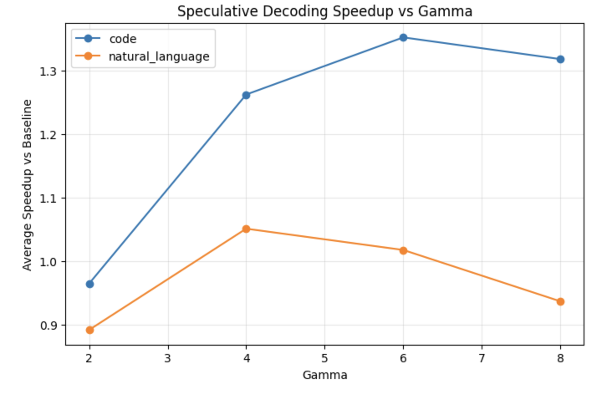

<!-- Improved compatibility of back to top link: See: https://github.com/othneildrew/Best-README-Template/pull/73 -->

<!--
*** Thanks for checking out the Best-README-Template. If you have a suggestion
*** that would make this better, please fork the repo and create a pull request
*** or simply open an issue with the tag "enhancement".
*** Don't forget to give the project a star!
*** Thanks again! Now go create something AMAZING! :D
-->

<!-- PROJECT SHIELDS -->
<!--
*** I'm using markdown "reference style" links for readability.
*** Reference links are enclosed in brackets [ ] instead of parentheses ( ).
*** See the bottom of this document for the declaration of the reference variables
*** for contributors-url, forks-url, etc. This is an optional, concise syntax you may use.
*** https://www.markdownguide.org/basic-syntax/#reference-style-links
-->
[![LinkedIn][linkedin-shield]][linkedin-url]

<!-- PROJECT LOGO -->
 

<h3 align="center">Speculative Decoding for Faster LLM Inference</h3>

  

    Not all routes are equal—StreetSense shows you how risk really changes along your walk in San Francisco.
     
    <a href="https://github.com/aneeshp10"><strong>Explore the docs »</strong></a>
     
     
    <a href="https://github.com/github_username/repo_name">View Demo</a>
    &middot;
    <a href="https://github.com/github_username/repo_name/issues/new?labels=bug&template=bug-report---.md">Report Bug</a>
    &middot;
    <a href="https://github.com/github_username/repo_name/issues/new?labels=enhancement&template=feature-request---.md">Request Feature</a>
  

<!-- TABLE OF CONTENTS -->

  
Table of Contents

  <ol>
    <li>
      <a href="#about-streetsense-san-francisco">About StreetSense San Francisco</a>
    </li>
    <li>
      <a href="#how-it-works-high-level">How It Works (High-Level)</a>
    </li>
    <li>
      <a href="#what-streetsense-is-and-isnt">What StreetSense Is (and isn’t)</a>
    </li>
    <li>
      <a href="#tech-stack">Tech Stack</a>
    </li>
    <li>
      <a href="#limitations">Limitations</a>
    </li>
    <li>
      <a href="#potential-improvements">Potential Improvements</a>
    </li>
    <li>
      <a href="#contributing">Contributing</a>
    </li>
  </ol>

<!-- ABOUT THE PROJECT -->
## About

This project implements speculative decoding from scratch using a draft and target transformer model to accelerate autoregressive text generation.
Speculative decoding is a technique that improves inference speed by allowing a smaller draft model to propose multiple tokens at once, which are then verified by a larger target model. If the tokens are accepted, the target model can skip multiple generation steps, reducing overall latency.
The goal of this project was to understand how speculative decoding works internally and measure the real performance gains in practice.

(<a href="#readme-top">back to top</a>)

<!-- GETTING STARTED -->
## Motivation
Autoregressive generation in large language models is inherently slow because tokens are generated one at a time.
Speculative decoding addresses this by:
  - Using a smaller draft model to generate several candidate tokens
  - Letting the larger target model verify them in parallel
  - Accepting valid tokens and skipping generation steps
  - When the acceptance rate is high, the target model can effectively generate multiple tokens per step, significantly improving throughput.

## Process
The implementation follows the speculative decoding algorithm described in the literature.
At each step:
  - The draft model proposes γ tokens.
  - The target model evaluates the probability of those tokens.
  - Tokens are accepted or rejected using the verification rule.
  - Accepted tokens are appended to the output.
  - If rejection occurs, the target model samples the next token normally.
This process repeats until the sequence is complete.

## Experiment Setup
To evaluate the implementation, I tested speculative decoding across:
Two prompt categories
  - Natural language prompts
  - Algorithmic / coding prompts
  
Different draft lengths (γ) => γ = 2, 4, 6, 8
For each run I measured:
  - Acceptance rate
  - Tokens generated per second
  - End-to-end generation speed

## Tech Stack

- Backend: Python, Pandas, Numpy, FastAPI
- Machine Learning Modeling: XGBoost (Tweedie regression)
- Frontend: React + Vite, Google Maps API
- Geospatial indexing: H3
- Deployment: Vercel (frontend), Render (backend)

## Results

Key observations from the experiments:
  - Acceptance rate: ~75% on average
  - Speedup: ~1.5× compared to baseline autoregressive decoding
  - Increasing γ improves speed up to a point, after which diminishing returns appear.
These results show that speculative decoding can provide meaningful inference acceleration even with a relatively simple implementation.

 

## Future Improvements
- Add KV-Cache Support
  - This version does not include a KV-Cache. Each verification step recomputes attention for the full sequence instead of reusing cached key/value tensors from previous tokens.
  - Because of this, the measured speedups represent the gains from speculative decoding alone, rather than the combination of speculative decoding and standard inference optimizations
- Explore Different Draft/Target Model Pairs
  - Different architecture families, distilled models, finetuned models, etc.
- Batched Speculative Decoding
  -  Extending this implementation to support batched speculative decoding would better simulate production LLM inference pipelines.
-  Benchmark Longer Generations
  - The current evaluation primarily measures tokens/sec and acceptance rate. A deeper evaluation could include: time-to-first-token (TTFT), per-token latency, end-to-end latency

## Contributing

Contributions are what make the open source community such an amazing place to learn, inspire, and create. Any contributions you make are **greatly appreciated**.

If you have a suggestion that would make this better, please fork the repo and create a pull request. You can also simply open an issue with the tag "enhancement".
Don't forget to give the project a star! Thanks again!

1. Fork the Project
2. Create your Feature Branch (`git checkout -b feature/AmazingFeature`)
3. Commit your Changes (`git commit -m 'Add some AmazingFeature'`)
4. Push to the Branch (`git push origin feature/AmazingFeature`)
5. Open a Pull Request

(<a href="#readme-top">back to top</a>)

<!-- MARKDOWN LINKS & IMAGES -->
<!-- https://www.markdownguide.org/basic-syntax/#reference-style-links -->
[contributors-shield]: https://img.shields.io/github/contributors/github_username/repo_name.svg?style=for-the-badge
[contributors-url]: https://aneeshpatil.bearblog.dev/
[forks-shield]: https://img.shields.io/github/forks/github_username/repo_name.svg?style=for-the-badge
[forks-url]: https://github.com/github_username/repo_name/network/members
[stars-shield]: https://img.shields.io/github/stars/github_username/repo_name.svg?style=for-the-badge
[stars-url]: https://github.com/github_username/repo_name/stargazers
[issues-shield]: https://img.shields.io/github/issues/github_username/repo_name.svg?style=for-the-badge
[issues-url]: https://github.com/github_username/repo_name/issues
[license-shield]: https://img.shields.io/github/license/github_username/repo_name.svg?style=for-the-badge
[license-url]: https://github.com/github_username/repo_name/blob/master/LICENSE.txt
[linkedin-shield]: https://img.shields.io/badge/-LinkedIn-black.svg?style=for-the-badge&logo=linkedin&colorB=555
[linkedin-url]: https://www.linkedin.com/in/aneesh-patil/
[product-screenshot]: images/streetsense_image.png
<!-- Shields.io badges. You can a comprehensive list with many more badges at: https://github.com/inttter/md-badges -->
[Next.js]: https://img.shields.io/badge/next.js-000000?style=for-the-badge&logo=nextdotjs&logoColor=white
[Next-url]: https://nextjs.org/
[React.js]: https://img.shields.io/badge/React-20232A?style=for-the-badge&logo=react&logoColor=61DAFB
[React-url]: https://reactjs.org/
[Vue.js]: https://img.shields.io/badge/Vue.js-35495E?style=for-the-badge&logo=vuedotjs&logoColor=4FC08D
[Vue-url]: https://vuejs.org/
[Angular.io]: https://img.shields.io/badge/Angular-DD0031?style=for-the-badge&logo=angular&logoColor=white
[Angular-url]: https://angular.io/
[Svelte.dev]: https://img.shields.io/badge/Svelte-4A4A55?style=for-the-badge&logo=svelte&logoColor=FF3E00
[Svelte-url]: https://svelte.dev/
[Laravel.com]: https://img.shields.io/badge/Laravel-FF2D20?style=for-the-badge&logo=laravel&logoColor=white
[Laravel-url]: https://laravel.com
[Bootstrap.com]: https://img.shields.io/badge/Bootstrap-563D7C?style=for-the-badge&logo=bootstrap&logoColor=white
[Bootstrap-url]: https://getbootstrap.com
[JQuery.com]: https://img.shields.io/badge/jQuery-0769AD?style=for-the-badge&logo=jquery&logoColor=white
[JQuery-url]: https://jquery.com 
